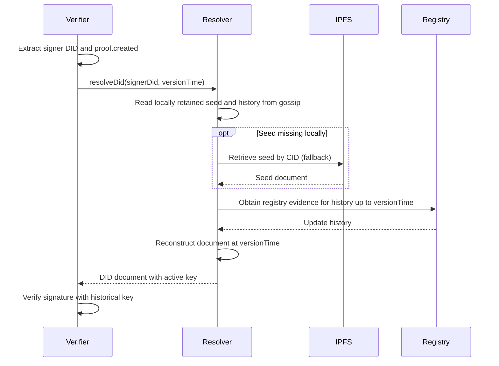

## Proof Verification

### Credential and application proofs

[[def: temporal resolution, Resolving a DID at a specific point in time to retrieve historical key state at a proof's claimed creation time]]

When verifying a proof on a credential or other signed application object (not a DID operation), the verifier must resolve the signer's DID **at the proof's claimed creation time**. This is essential for supporting key rotation — credentials signed with an old key must remain verifiable even after the signer rotates to a new key.

The `proof.created` timestamp serves two purposes:

1. Records the signer's claimed proof time, not an independently trusted signing time.
1. Anchors verification to the correct historical key state.

### Verification Algorithm

```
function verifyProof(object):
    proofs = normalize object.proof to an array (absent means empty)
    unsecured = copy of object with proof removed
    for proof in proofs:
        if proof has no verificationMethod or its suite is unsupported:
            continue
        extract signerDid from proof.verificationMethod
        try:
            doc = resolve signerDid at versionTime = proof.created
        on resolution failure:
            continue
        if the supported suite verifies unsecured and proof against doc,
           including its named method and applicable proof-purpose checks:
            return valid
    return invalid
```

This [[ref: temporal resolution]] ensures that a credential issued in 2020 can still be verified in 2030, even if the issuer has rotated keys multiple times since issuance.

::: note
While the W3C Data Integrity specification makes `proof.created` optional, `did:cid` **requires** it to support proper verification after key rotation.
:::

Legacy `EcdsaSecp256k1Signature2019` credential proofs remain accepted for compatibility. Their proof configuration, including `created`, is not signed. Modern proofs bind that configuration, preventing timestamp alteration without the signing key; they do not prevent a signing-key holder from issuing a newly backdated proof. Rotation therefore does not by itself retire all credentials apparently signed before rotation.

Current Archon credentials use Data Integrity proofs, including the method-specific secp256k1 suite and `eddsa-jcs-2022`. A proof set succeeds when at least one supported proof verifies; unsupported suites do not make a valid supported proof fail. Proofs are independently removable, so adding a stronger proof does not disable acceptance under another supported proof.

### DID operation proofs

DID operations follow Operation Authorization, rather than the generic credential algorithm above. Accepted operation formats are:

| Format | Signing payload |
| --- | --- |
| `EcdsaSecp256k1Signature2019` | Legacy secp256k1 signature over the operation with `proof` removed; proof configuration is unsigned. |
| `DataIntegrityProof`, `cryptosuite: archon-ecdsa-secp256k1-jcs-2026` | secp256k1 signature binding both the proof configuration and unsecured operation. |

For the current suite, remove `proofValue` from the proof configuration and include the secured document's `@context` when present. Canonicalize configuration and unsecured document separately with RFC 8785, SHA-256 hash each, concatenate the two 32-byte hashes (configuration first), and SHA-256 hash the concatenation. Sign that digest with secp256k1 ECDSA, encoding compact `r || s` as unpadded base64url `proofValue`. A proof context that disagrees with the document is invalid. Legacy signing hashes the canonical unsecured operation instead. Signatures use the verifier's low-S requirement.

Operation proofs require `created`, a named `verificationMethod`, a supported `proofPurpose`, and a signature. New operations emit `capabilityInvocation`; version 1 also accepts historical `authentication` and `assertionMethod` purposes. These purpose labels do not introduce relationship-membership enforcement. The Archon suite is method-specific, not a claim to a registered W3C cryptosuite name. Ed25519 credential support does not imply Ed25519 DID operation acceptance.

### Verification Method Format

The `proof.verificationMethod` field identifies which key was used to create the proof. For DID operations, the reference format depends on the operation type:

| Operation | `verificationMethod` Format | Example |
|-----------|---------------------------|---------|
| Agent create | Relative reference `#key-1` (DID doesn't exist yet, proof is self-referential) | `#key-1` |
| Asset create | Full DID reference of the controller | `did:cid:abc123#key-1` |
| Update / Delete | Full DID reference of the controller | `did:cid:abc123#key-N` |

The following sequence illustrates credential verification only.


