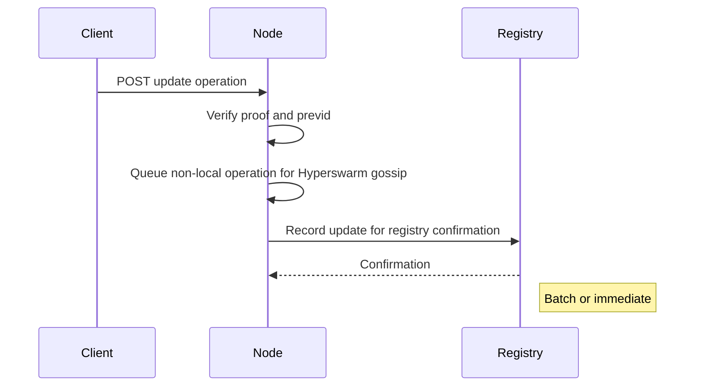

## DID Update

[[def: update operation, A signed operation that modifies the DID document associated with an existing DID, recorded on the DID's registry]]

A DID Update is a change to any of the documents associated with the DID. To initiate an update, the client must sign an operation that includes the following fields:

| Field | Required | Description |
|-------|----------|-------------|
| `type` | Yes | Must be `"update"` |
| `did` | Yes | The DID being updated |
| `doc` | Yes | The new version of the document set (may include any of `didDocument`, `didDocumentData`, `didDocumentRegistration`) |
| `previd` | Yes | The CID of the previous operation (collision-prevention hash link) |
| `blockid` | No | Current block ID on registry (if blockchain) |

### Update Flow

1. Create an update operation object with the fields above.
1. Sign the JSON with the private key of the controller of the DID.
1. Submit the signed operation to a node's DID endpoint.

::: note
It is recommended that the client fetches the current version of the document and metadata, makes changes to it, then submits the new version in an update operation in order to preserve fields that should not change.
:::

### Key Rotation Example

```json
{
    "type": "update",
    "did": "did:cid:bagaaiera7apdjgpe7jleguoioddew7oqqxn2iqlsowktnbnqksf7bpzuntka",
    "previd": "bagaaiera7apdjgpe7jleguoioddew7oqqxn2iqlsowktnbnqksf7bpzuntka",
    "doc": {
        "didDocument": {
            "@context": [
                "https://www.w3.org/ns/did/v1"
            ],
            "id": "did:cid:bagaaiera7apdjgpe7jleguoioddew7oqqxn2iqlsowktnbnqksf7bpzuntka",
            "verificationMethod": [
                {
                    "id": "#key-2",
                    "controller": "did:cid:bagaaiera7apdjgpe7jleguoioddew7oqqxn2iqlsowktnbnqksf7bpzuntka",
                    "type": "EcdsaSecp256k1VerificationKey2019",
                    "publicKeyJwk": {
                        "kty": "EC",
                        "crv": "secp256k1",
                        "x": "0yuKivfjdnOfFnVwfItXxq2fAQxbqCxg2XO_ekK-V3w",
                        "y": "IeSj9ICGo6vRMWffZBI0u0faTH9GX0tq7ipG3guSQC0"
                    }
                }
            ],
            "authentication": [
                "#key-2"
            ],
            "assertionMethod": [
                "#key-2"
            ],
            "capabilityInvocation": [
                "#key-2"
            ]
        }
    },
    "proof": {
        "type": "DataIntegrityProof",
        "cryptosuite": "archon-ecdsa-secp256k1-jcs-2026",
        "created": "2026-09-22T00:00:02.000Z",
        "verificationMethod": "did:cid:bagaaiera7apdjgpe7jleguoioddew7oqqxn2iqlsowktnbnqksf7bpzuntka#key-1",
        "proofPurpose": "capabilityInvocation",
        "proofValue": "vaIoFAAKhfzYRY3hrJNZ4QepScthCTOEREgDN-J1yhBtFoYA5GxkkUXWVSMPQaVFZ4AKY4UMgYFxgEHGM5jH2g"
    }
}
```

Upon receiving the operation, the node must:

1. Select the authorizing document under Operation Authorization and verify the proof.
1. For direct submission, require the current accepted head as `previd`. Imported competing branches use their selected predecessor under Protocol Rules.
1. Record the operation on the registry selected by the predecessor's registration (or forward the request to a trusted node that supports the specified registry).

### Batch vs. Immediate Registration

For registries such as BTC with non-trivial transaction costs, update operations will be placed in a queue and registered periodically in a batch in order to balance costs and latency. If the registry has trivial transaction costs, the update operation may be distributed individually and immediately. This method defers this tradeoff between cost, speed, and security to the node operators.



Supplied document components replace the entire component; omitted components remain unchanged. See Protocol Rules for immutable fields, registry migration, and competing updates. The rotation above is signed by the predecessor key `#key-1` and installs `#key-2`.
